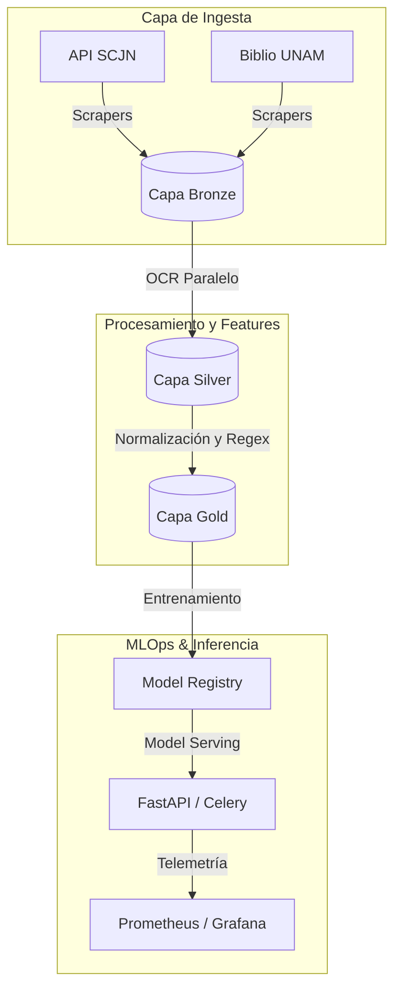

# BETO Legal México

## ⚖️ Resumen 

**BETO Legal México** es un modelo  de Procesamiento de Lenguaje Natural (NLP) diseñado específicamente para el análisis, clasificación y Reconocimiento de Entidades Nombradas (NER) en documentos legales y resoluciones jurídicas mexicanas.
### Origen y Fundamentos Técnicos
Este modelo es una evolución del aporte desarrollado por el **Instituto de Ingeniería del Conocimiento (IIC)**, construida a partir de una arquitectura robusta:
 * **Linaje:** Basado en **RigoBERTa-2.0**, que a su vez integra las capacidades de **BETO, BERT y Legal BERT**.
 * **Especialización:** Al igual que sus modelos base, es un sistema monolingüe diseñado para el español, pero con un *fine-tuning* específico que le permite comprender la terminología y estructura del sistema jurídico mexicano. 
* Utiliza BERT (multilingüe), reconocido como uno de los modelos más eficaces en el ecosistema actual de NLP.
### Arquitectura de Datos y Operaciones
El sistema garantiza un ciclo de vida de alto nivel mediante una infraestructura moderna:
 * **Ingesta Masiva:** Automatiza la recopilación de corpus legales desde fuentes oficiales como la **Suprema Corte de Justicia de la Nación (SCJN)** y la **Biblioteca Jurídica de la UNAM**.
 * **Gestión de Datos:** Utiliza una arquitectura **Lakehouse** estructurada en capas de calidad (Bronze, Silver, Gold).
 * **Gestión de ML:** Implementa un stack sólido de **MLOps** para el despliegue y monitoreo constante del modelo.
### Visión y Proyección
El objetivo principal de BETO Legal México es robustecer el desarrollo de modelos en español, mejorando significativamente los resultados en tareas complejas de lenguaje.
 * **Evolución:** La hoja de ruta contempla la integración de **GPT con un sistema RAG** (Retrieval-Augmented Generation) cargado con documentos legales. Esto permitirá mejorar drásticamente la redacción automatizada de sentencias y oficios.

El proyecto busca servir como hoja de ruta para que otros países latinoamericanos puedan "tropicalizar" modelos de NLP a sus propias necesidades jurídicas, fomentando la soberanía tecnológica en la región.


---

## 🚀 Características Principales
* **Ingesta y Extracción Automatizada:** Scrapers modulares para la API de Engroses de la SCJN y tomos de diccionarios jurídicos de la UNAM.
* **Procesamiento OCR Paralelo:** Pipeline de extracción de texto asíncrono optimizado para PDFs escaneados utilizando Tesseract OCR con soporte lingüístico adaptado al español jurídico.
* **Arquitectura de Datos Medallion:** Flujo de datos robusto con trazabilidad completa:
    * **Bronze:** Datos tabulares estructurados (JSON/Excel) y binarios crudos.
    * **Silver:** Texto extraído mediante OCR, limpieza de ruido sintáctico y unificación.
    * **Gold:** Tokens normalizados, remoción selectiva de stopwords y esquemas listos para entrenamiento de embeddings.
* **Stack Inferencia & MLOps Completo:** Orquestación con Airflow, despliegue asíncrono con FastAPI y Celery, infraestructura administrada con Terraform/Kubernetes y telemetría avanzada mediante Prometheus y Grafana.

---

## 📁 Estructura del Repositorio

```text
.
├── .github/workflows/          # Pipelines de CI/CD (Staging, Production, Hugo Pages)
├── deployment/                 # Configuraciones de Infraestructura y Despliegue
│   ├── airflow/                # DAGs de monitoreo, scraping y entrenamiento
│   ├── docker/                 # Dockerfiles para API, Workers y Training
│   ├── kubernetes/             # Manifiestos base de K8s y Charts de Helm
│   └── terraform/              # Infraestructura como Código para GCP (GKE, GCS, IAM)
├── docs/                       # Documentación técnica y del sistema
│   ├── architecture/           # Especificaciones de diseño y diagramas PlantUML
│   ├── hugo/                   # Portal de documentación estática (Plantilla Book)
│   ├── model_cards/            # Fichas técnicas de los modelos entrenados (Classifier, NER)
│   └── runbooks/               # Guías operativas frente a incidentes y despliegues
├── latex/                      # Plantillas académicas e institucionales (IPH)
├── monitoring/                 # Configuración de observabilidad (Prometheus & Grafana)
├── notebooks/                  # Demos, experimentos de dominio y prototipado
├── scripts/                    # Utilidades de entorno, respaldos y automatizaciones rápidas
├── src/
│   └── Beto/                   # Código fuente principal del paquete
│       ├── pipeline/           # Módulos de Ingesta, Features, Modelado y Monitoreo
│       └── utils/              # Gestores dinámicos de configuración y preprocesamiento
├── tests/                      # Pruebas Unitarias, Integración y Performance (Load Tests)
├── pyproject.toml              # Definición moderna del paquete y dependencias core
└── requirements.txt            # Congelamiento de dependencias del entorno
```
---
# **Aviso Importante**
### Documentación en Hugo 

Para revisar la documentación de arquitectura con hugo consulta la siguiente página:
https://brams153.github.io/BETO_Legal_Mexico/
---

## 🛠️ Requisitos del Sistema e Instalación
### 1. Dependencias de Linux
El pipeline de OCR requiere herramientas nativas del sistema para la rasterización de PDFs y el análisis óptico de caracteres en español. Desde tu terminal (ej. Alacritty en Lubuntu), ejecuta:
```bash
sudo apt update
sudo apt install -y tesseract-ocr tesseract-ocr-spa poppler-utils python3.10-venv

```
### 2. Configuración del Entorno Virtual
Puedes preparar el entorno utilizando el gestor tradicional pip o mediante uv para una resolución determinista ultrarrápida:
**Opción A: Uso eficiente con uv (Recomendado)**
```bash
uv sync

```
**Opción B: Uso tradicional con pip**
```bash
python3 -m venv .venv
source .venv/bin/activate
pip install -e .

```
### 3. Estructura de Almacenamiento Local
Crea los directorios del Lakehouse local antes de iniciar las ejecuciones:
```bash
mkdir -p data/{bronze,silver,gold}

```
## 💻 Guía Práctica de Ejecución
### 1. Ingesta desde el Repositorio de la SCJN
Para descargar y estructurar los metadatos de los engroses de la Suprema Corte de Justicia:
```bash
python src/Beto/pipeline/01_ingestion/scrapers/repositorio_scjn/scrapper_scjn.py

```
*Esto generará un archivo mapeado en data/bronze/scjn/datos_limpios.json y una réplica de validación analítica en scjn_api.xlsx.*
### 2. Ejecución del Pipeline OCR (Bronze -> Silver)
Una vez almacenados los archivos PDF en data/bronze/diccionarios/, procesa la extracción paralela hacia texto plano ejecutable:
```bash
python src/Beto/pipeline/pipelines/ocr_extraction.py

```
*El script consolida el contenido ordenado alfabéticamente dentro de data/silver/diccionarios/diccionario_completo.txt de manera automatizada.*
## 📊 Arquitectura General del Sistema
El flujo de información se rige por un esquema modular interconectado:

## 📝 Licencia y Autores
Desarrollado como un ecosistema avanzado de procesamiento de datos públicos y adaptaciones analíticas.
 * **Autor:** Mireles Alcántara Abraham Apolinar
 * **Institución Referencial:** FCPyS - UNAM
## Bibliografía 
Por rigor académico, es necesario incluir citas en APA de los papers consultados y reconociendo la labor de los siguientes autores:
### Modelos:
- Instituto de Ingeniería del Conocimiento. (2025). _RigoBERTa-2.0_ [Modelo de lenguaje]. Hugging Face. https://doi.org/10.57967/hf/7048 
-
### Papers
- Devlin, J., Chang, M. W., Lee, K., & Toutanova, K. (2019). BERT: Pre-training of deep bidirectional transformers for language understanding. En _Proceedings of the 2019 Conference of the North American Chapter of the Association for Computational Linguistics: Human Language Technologies, Volume 1 (Long and Short Papers)_ (pp. 4171–4186). Association for Computational Linguistics.

- Cañete, J., Chaperon, G., Fuentes, R., Ho, J. H., Kang, H., & Pérez, J. (2020). _BETO: Spanish BERT_ [Modelo de lenguaje]. Hugging Face. https://huggingface.co/dccuchile/bert-base-spanish-wwm-uncased 

