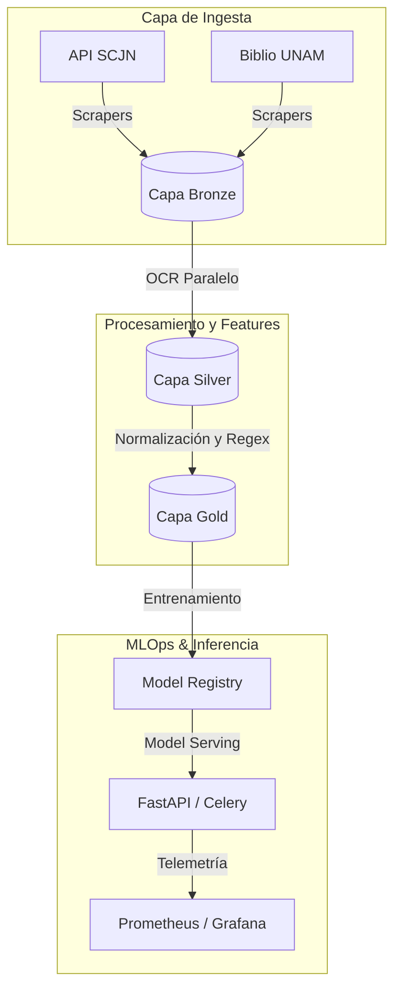

# BETO Legal México

## ⚖️ Resumen 
**BETO Legal México** es un ecosistema avanzado de Procesamiento de Lenguaje Natural (NLP) diseñado específicamente para el análisis, clasificación y Reconocimiento de Entidades Nombradas (NER) de documentos legales y resoluciones jurídicas en México. 

El sistema automatiza la ingesta masiva de corpus desde fuentes clave como la **Suprema Corte de Justicia de la Nación (SCJN)** y la **Biblioteca Jurídica de la UNAM**, procesando la información a través de una arquitectura Lakehouse estructurada en capas (Bronze, Silver, Gold) y gestionando el ciclo de vida completo de los modelos mediante un sólido stack de **MLOps**.

---

## 🚀 Características Principales
* **Ingesta y Extracción Automatizada:** Scrapers modulares para la API de Engroses de la SCJN y tomos de diccionarios jurídicos de la UNAM.
* **Procesamiento OCR Paralelo:** Pipeline de extracción de texto asíncrono optimizado para PDFs escaneados utilizando Tesseract OCR con soporte lingüístico adaptado al español jurídico.
* **Arquitectura de Datos Medallion:** Flujo de datos robusto con trazabilidad completa:
    * **Bronze:** Datos tabulares estructurados (JSON/Excel) y binarios crudos.
    * **Silver:** Texto extraído mediante OCR, limpieza de ruido sintáctico y unificación.
    * **Gold:** Tokens normalizados, remoción selectiva de stopwords y esquemas listos para entrenamiento de embeddings.
* **Stack Inferencia & MLOps Completo:** Orquestación con Airflow, despliegue asíncrono con FastAPI y Celery, infraestructura administrada con Terraform/Kubernetes y telemetría avanzada mediante Prometheus y Grafana.

---

## 📁 Estructura del Repositorio
<!-- readme-tree start -->
```
.
├── .dvcignore
├── .github
│   └── workflows
│       ├── cd-production.yml
│       ├── cd-staging.yml
│       ├── ci.yml
│       ├── hugo.yml
│       └── tree.yml
├── .gitignore
├── .gitmodules
├── LICENSE
├── Makefile
├── README.md
├── content
│   └── docs
│       ├── _index.md
│       ├── api_specification.md
│       ├── architecture.md
│       ├── configuration.md
│       ├── data_pipeline.md
│       ├── data_schema.md
│       ├── installation.md
│       ├── modules.md
│       ├── system_design.md
│       ├── text_preprocessing.md
│       ├── uml.md
│       └── usage_examples.md
├── data
│   ├── README.md
│   ├── bronze
│   │   ├── diccionarios
│   │   │   ├── 1168_01_2.pdf
│   │   │   └── 1168_02_4.pdf
│   │   └── scjn
│   │       ├── datos_limpios.json
│   │       └── scjn_api.xlsx
│   └── silver
│       └── diccionarios
│           └── diccionario_completo.txt
├── deployment
│   ├── airflow
│   │   └── dags
│   │       ├── monitoring_pipeline.py
│   │       ├── scraping_pipeline.py
│   │       └── training_pipeline.py
│   ├── docker
│   │   ├── Dockerfile.api
│   │   ├── Dockerfile.training
│   │   ├── Dockerfile.worker
│   │   └── docker-compose.yml
│   ├── kubernetes
│   │   ├── base
│   │   │   ├── api-deployment.yaml
│   │   │   ├── ingress.yaml
│   │   │   ├── postgres-statefulset.yaml
│   │   │   └── triton-deployment.yaml
│   │   └── helm
│   │       └── beto-legal
│   │           ├── Chart.yaml
│   │           └── values.yaml
│   └── terraform
│       ├── gcs.tf
│       ├── gke.tf
│       ├── iam.tf
│       ├── main.tf
│       ├── outputs.tf
│       └── variables.tf
├── docs
│   ├── architecture
│   │   └── diagrams
│   │       └── puml
│   │           ├── data_pipeline.puml
│   │           ├── features.puml
│   │           ├── full_arquitecture.puml
│   │           ├── mlops.puml
│   │           ├── serving.puml
│   │           └── training.puml
│   ├── model_cards
│   │   ├── beto_legal_classifier.md
│   │   └── beto_legal_ner.md
│   ├── runbooks
│   │   ├── deployment.md
│   │   ├── incident_response.md
│   │   └── troubleshooting.md
│   └── tutorials
│       ├── advanced_usage.md
│       └── quickstart.md
├── hugo.toml
├── monitoring
│   ├── grafana
│   │   └── dashboards
│   │       ├── api_metrics.json
│   │       └── model_performance.json
│   └── prometheus
│       ├── prometheus.yml
│       └── rules
│           └── alerts.yml
├── notebooks
│   ├── demos
│   │   └── inference_demo.ipynb
│   ├── experiments
│   │   ├── exp_001_baseline.ipynb
│   │   └── exp_002_domain_adaptation.ipynb
│   └── exploration
│       ├── 01_data_analysis.ipynb
│       └── 02_model_prototyping.ipynb
├── pyproject.toml
├── requirements.txt
├── resources
│   └── _gen
│       └── assets
│           ├── book.scss_b807c86e8030af4cdc30edccea379f5f.content
│           └── book.scss_b807c86e8030af4cdc30edccea379f5f.json
├── scripts
│   ├── backup_database.sh
│   ├── deploy_model.sh
│   ├── download_data.sh
│   └── setup_environment.sh
├── src
│   └── Beto
│       ├── pipeline
│       │   ├── 01_ingestion
│       │   │   └── scrapers
│       │   │       ├── diccionarios
│       │   │       │   └── scrapper_diccionario_juridico.py
│       │   │       └── repositorio_scjn
│       │   │           ├── scrapper_scjn.py
│       │   │           └── scrapper_scjn_boletin.py
│       │   ├── 02_storage
│       │   │   ├── __init__.py
│       │   │   ├── minio_client.py
│       │   │   └── postgres_client.py
│       │   ├── 03_processing
│       │   │   ├── __init__.py
│       │   │   └── ocr_extraction.py
│       │   ├── 04_features
│       │   │   ├── __init__.py
│       │   │   ├── datasets
│       │   │   │   ├── __init__.py
│       │   │   │   ├── classification.py
│       │   │   │   ├── ner.py
│       │   │   │   ├── retrieval.py
│       │   │   │   └── summarization.py
│       │   │   ├── schemas
│       │   │   │   ├── __init__.py
│       │   │   │   ├── classification_schema.py
│       │   │   │   ├── ner_schema.py
│       │   │   │   └── retrieval_schema.py
│       │   │   └── transforms
│       │   │       ├── __init__.py
│       │   │       ├── augmentation.py
│       │   │       ├── chunking.py
│       │   │       └── tokenization.py
│       │   ├── 05_training
│       │   │   ├── __init__.py
│       │   │   ├── classification
│       │   │   │   ├── evaluate.py
│       │   │   │   ├── model.py
│       │   │   │   └── train.py
│       │   │   ├── domain_adaptation
│       │   │   │   └── continue_pretraining.py
│       │   │   ├── hpo
│       │   │   │   └── optuna_search.py
│       │   │   ├── ner
│       │   │   │   ├── bilstm_crf.py
│       │   │   │   ├── evaluate.py
│       │   │   │   └── train.py
│       │   │   ├── train_classifier.py
│       │   │   ├── train_ner.py
│       │   │   └── trainer.py
│       │   ├── 06_modeling
│       │   │   ├── __init__.py
│       │   │   ├── checkpoints
│       │   │   │   └── __init__.py
│       │   │   ├── evaluation
│       │   │   │   ├── __init__.py
│       │   │   │   ├── benchmark.py
│       │   │   │   ├── error_analysis.py
│       │   │   │   └── metrics.py
│       │   │   ├── inference
│       │   │   │   ├── __init__.py
│       │   │   │   ├── embed.py
│       │   │   │   ├── pipeline.py
│       │   │   │   └── predict.py
│       │   │   └── registry
│       │   │       ├── __init__.py
│       │   │       ├── model_registry.py
│       │   │       └── versioning.py
│       │   ├── 07_serving
│       │   │   ├── __init__.py
│       │   │   ├── api.py
│       │   │   ├── batch_inference.py
│       │   │   ├── celery_tasks.py
│       │   │   ├── model_manager.py
│       │   │   └── xai_service.py
│       │   └── 08_monitoring
│       │       ├── drift_detection.py
│       │       └── model_monitor.py
│       ├── templates
│       │   └── latex
│       │       ├── plantilla_iph.aux
│       │       ├── plantilla_iph.log
│       │       ├── plantilla_iph.tex
│       │       └── texput.log
│       └── utils
│           ├── client.py
│           ├── config.py
│           ├── metrics.py
│           └── preprocessing.py
├── static
│   └── images
│       └── pipelines_uml
│           ├── data_pipeline.png
│           ├── features.png
│           ├── mlops.png
│           ├── serving.png
│           └── training.png
├── tests
│   ├── integration
│   │   ├── test_end_to_end.py
│   │   └── test_inference_pipeline.py
│   ├── performance
│   │   └── test_load.py
│   └── unit
│       ├── test_api.py
│       ├── test_data_pipeline.py
│       └── test_models.py
├── themes
│   └── book
│       ├── .github
│       │   └── workflows
│       │       ├── deploy.yml
│       │       └── main.yml
│       ├── .gitignore
│       ├── LICENSE
│       ├── README.md
│       ├── archetypes
│       │   ├── book.md
│       │   ├── docs.md
│       │   ├── landing.md
│       │   └── posts.md
│       ├── assets
│       │   ├── _custom.scss
│       │   ├── _defaults.scss
│       │   ├── _fonts.scss
│       │   ├── _main.scss
│       │   ├── _markdown.scss
│       │   ├── _print.scss
│       │   ├── _shortcodes.scss
│       │   ├── _utils.scss
│       │   ├── _variables.scss
│       │   ├── book.scss
│       │   ├── clipboard.js
│       │   ├── icons
│       │   │   ├── backward.svg
│       │   │   ├── calendar.svg
│       │   │   ├── chevron-right.svg
│       │   │   ├── edit.svg
│       │   │   ├── forward.svg
│       │   │   ├── markdown.svg
│       │   │   ├── menu.svg
│       │   │   ├── toc.svg
│       │   │   └── translate.svg
│       │   ├── katex.json
│       │   ├── manifest.json
│       │   ├── menu-reset.js
│       │   ├── mermaid.json
│       │   ├── normalize.css
│       │   ├── plugins
│       │   │   ├── _numbered.scss
│       │   │   ├── _scrollbars.scss
│       │   │   └── _themes.scss
│       │   ├── search-data.json
│       │   ├── search.js
│       │   ├── sw-register.js
│       │   └── sw.js
│       ├── exampleSite
│       │   ├── assets
│       │   │   ├── _custom.scss
│       │   │   ├── _variables.scss
│       │   │   ├── asciinema-627097.cast
│       │   │   ├── book-starter.cast
│       │   │   ├── icons
│       │   │   │   ├── apparel.svg
│       │   │   │   └── rocket.svg
│       │   │   ├── placeholder.svg
│       │   │   ├── thumbnail.svg
│       │   │   └── tictactoe.json
│       │   ├── content.en
│       │   │   ├── _index.md
│       │   │   ├── book
│       │   │   │   └── index.md
│       │   │   ├── docs
│       │   │   │   ├── _index.md
│       │   │   │   ├── content
│       │   │   │   │   ├── _index.md
│       │   │   │   │   ├── blog.md
│       │   │   │   │   ├── menus.md
│       │   │   │   │   ├── multilingual.md
│       │   │   │   │   ├── organisation.md
│       │   │   │   │   ├── pages.md
│       │   │   │   │   └── shortcodes
│       │   │   │   │       ├── _index.md
│       │   │   │   │       ├── asciinema.md
│       │   │   │   │       ├── buttons.md
│       │   │   │   │       ├── columns.md
│       │   │   │   │       ├── details.md
│       │   │   │   │       ├── experimental
│       │   │   │   │       │   ├── _index.md
│       │   │   │   │       │   ├── images.md
│       │   │   │   │       │   └── openapi.md
│       │   │   │   │       ├── hints.md
│       │   │   │   │       ├── katex.md
│       │   │   │   │       ├── mermaid.md
│       │   │   │   │       ├── section.md
│       │   │   │   │       ├── steps.md
│       │   │   │   │       └── tabs.md
│       │   │   │   ├── customization
│       │   │   │   │   ├── _index.md
│       │   │   │   │   ├── inject-partials.md
│       │   │   │   │   └── styles.md
│       │   │   │   └── getting-started
│       │   │   │       ├── _index.md
│       │   │   │       ├── configuration.md
│       │   │   │       ├── create-a-site.md
│       │   │   │       └── introduction.md
│       │   │   ├── posts
│       │   │   │   ├── _index.md
│       │   │   │   └── example-post.md
│       │   │   └── showcases.md
│       │   ├── content.he
│       │   │   ├── _index.md
│       │   │   └── docs
│       │   │       └── _index.md
│       │   ├── content.zh
│       │   │   ├── _index.md
│       │   │   └── docs
│       │   │       └── _index.md
│       │   ├── hugo.toml
│       │   └── hugo.yaml
│       ├── go.mod
│       ├── hugo.toml
│       ├── i18n
│       │   ├── am.yaml
│       │   ├── bg.yaml
│       │   ├── bn.yaml
│       │   ├── cn.yaml
│       │   ├── cs.yaml
│       │   ├── de.yaml
│       │   ├── en.yaml
│       │   ├── es.yaml
│       │   ├── fa.yaml
│       │   ├── fr.yaml
│       │   ├── he.yaml
│       │   ├── it.yaml
│       │   ├── ja.yaml
│       │   ├── jp.yaml
│       │   ├── ko.yaml
│       │   ├── nb.yaml
│       │   ├── nl.yaml
│       │   ├── oc.yaml
│       │   ├── pl.yaml
│       │   ├── pt-BR.yaml
│       │   ├── pt.yaml
│       │   ├── ru.yaml
│       │   ├── sv.yaml
│       │   ├── sw.yaml
│       │   ├── tr.yaml
│       │   ├── uk.yaml
│       │   ├── zh-TW.yaml
│       │   └── zh.yaml
│       ├── images
│       │   ├── screenshot.png
│       │   └── tn.png
│       ├── layouts
│       │   ├── 404.html
│       │   ├── _markup
│       │   │   ├── render-blockquote.html
│       │   │   ├── render-codeblock-katex.html
│       │   │   ├── render-codeblock-mermaid.html
│       │   │   ├── render-codeblock.html
│       │   │   ├── render-heading.html
│       │   │   ├── render-image.html
│       │   │   └── render-link.html
│       │   ├── _partials
│       │   │   └── docs
│       │   │       ├── brand.html
│       │   │       ├── comments.html
│       │   │       ├── copyright.html
│       │   │       ├── date.html
│       │   │       ├── footer.html
│       │   │       ├── header.html
│       │   │       ├── html-attrs.html
│       │   │       ├── html-head-favicon.html
│       │   │       ├── html-head-title.html
│       │   │       ├── html-head.html
│       │   │       ├── icon.html
│       │   │       ├── inject
│       │   │       │   ├── body.html
│       │   │       │   ├── content-after.html
│       │   │       │   ├── content-before.html
│       │   │       │   ├── footer.html
│       │   │       │   ├── head.html
│       │   │       │   ├── menu-after.html
│       │   │       │   ├── menu-before.html
│       │   │       │   ├── toc-after.html
│       │   │       │   └── toc-before.html
│       │   │       ├── languages.html
│       │   │       ├── links
│       │   │       │   ├── commit.html
│       │   │       │   ├── edit.html
│       │   │       │   ├── home.html
│       │   │       │   ├── portable-image.html
│       │   │       │   ├── portable-link.html
│       │   │       │   └── resource-precache.html
│       │   │       ├── menu-filetree.html
│       │   │       ├── menu-hugo.html
│       │   │       ├── menu-section-pages.html
│       │   │       ├── menu-section.html
│       │   │       ├── menu.html
│       │   │       ├── pagination.html
│       │   │       ├── post-meta.html
│       │   │       ├── post-prev-next.html
│       │   │       ├── prev-next.html
│       │   │       ├── search.html
│       │   │       ├── taxonomy.html
│       │   │       ├── text
│       │   │       │   ├── i18n.html
│       │   │       │   ├── mapper.html
│       │   │       │   ├── shortcode-id.html
│       │   │       │   └── template.html
│       │   │       ├── title.html
│       │   │       ├── toc-show.html
│       │   │       └── toc.html
│       │   ├── _shortcodes
│       │   │   ├── asciinema.html
│       │   │   ├── button.html
│       │   │   ├── columns.html
│       │   │   ├── details.html
│       │   │   ├── hint.html
│       │   │   ├── html.html
│       │   │   ├── i18n.html
│       │   │   ├── image.html
│       │   │   ├── katex.html
│       │   │   ├── mermaid.html
│       │   │   ├── openapi.html
│       │   │   ├── section.html
│       │   │   ├── steps.html
│       │   │   ├── tab.html
│       │   │   └── tabs.html
│       │   ├── all.txt
│       │   ├── baseof.html
│       │   ├── book.html
│       │   ├── book.txt
│       │   ├── landing.html
│       │   ├── list.html
│       │   ├── posts
│       │   │   ├── list.html
│       │   │   └── single.html
│       │   ├── single.html
│       │   └── term.html
│       ├── static
│       │   ├── asciinema
│       │   │   ├── asciinema-auto.js
│       │   │   ├── asciinema-player.css
│       │   │   └── asciinema-player.min.js
│       │   ├── favicon.png
│       │   ├── favicon.svg
│       │   ├── fuse.min.mjs
│       │   ├── katex
│       │   │   ├── auto-render.min.js
│       │   │   ├── fonts
│       │   │   │   ├── KaTeX_AMS-Regular.ttf
│       │   │   │   ├── KaTeX_AMS-Regular.woff
│       │   │   │   ├── KaTeX_AMS-Regular.woff2
│       │   │   │   ├── KaTeX_Caligraphic-Bold.ttf
│       │   │   │   ├── KaTeX_Caligraphic-Bold.woff
│       │   │   │   ├── KaTeX_Caligraphic-Bold.woff2
│       │   │   │   ├── KaTeX_Caligraphic-Regular.ttf
│       │   │   │   ├── KaTeX_Caligraphic-Regular.woff
│       │   │   │   ├── KaTeX_Caligraphic-Regular.woff2
│       │   │   │   ├── KaTeX_Fraktur-Bold.ttf
│       │   │   │   ├── KaTeX_Fraktur-Bold.woff
│       │   │   │   ├── KaTeX_Fraktur-Bold.woff2
│       │   │   │   ├── KaTeX_Fraktur-Regular.ttf
│       │   │   │   ├── KaTeX_Fraktur-Regular.woff
│       │   │   │   ├── KaTeX_Fraktur-Regular.woff2
│       │   │   │   ├── KaTeX_Main-Bold.ttf
│       │   │   │   ├── KaTeX_Main-Bold.woff
│       │   │   │   ├── KaTeX_Main-Bold.woff2
│       │   │   │   ├── KaTeX_Main-BoldItalic.ttf
│       │   │   │   ├── KaTeX_Main-BoldItalic.woff
│       │   │   │   ├── KaTeX_Main-BoldItalic.woff2
│       │   │   │   ├── KaTeX_Main-Italic.ttf
│       │   │   │   ├── KaTeX_Main-Italic.woff
│       │   │   │   ├── KaTeX_Main-Italic.woff2
│       │   │   │   ├── KaTeX_Main-Regular.ttf
│       │   │   │   ├── KaTeX_Main-Regular.woff
│       │   │   │   ├── KaTeX_Main-Regular.woff2
│       │   │   │   ├── KaTeX_Math-BoldItalic.ttf
│       │   │   │   ├── KaTeX_Math-BoldItalic.woff
│       │   │   │   ├── KaTeX_Math-BoldItalic.woff2
│       │   │   │   ├── KaTeX_Math-Italic.ttf
│       │   │   │   ├── KaTeX_Math-Italic.woff
│       │   │   │   ├── KaTeX_Math-Italic.woff2
│       │   │   │   ├── KaTeX_SansSerif-Bold.ttf
│       │   │   │   ├── KaTeX_SansSerif-Bold.woff
│       │   │   │   ├── KaTeX_SansSerif-Bold.woff2
│       │   │   │   ├── KaTeX_SansSerif-Italic.ttf
│       │   │   │   ├── KaTeX_SansSerif-Italic.woff
│       │   │   │   ├── KaTeX_SansSerif-Italic.woff2
│       │   │   │   ├── KaTeX_SansSerif-Regular.ttf
│       │   │   │   ├── KaTeX_SansSerif-Regular.woff
│       │   │   │   ├── KaTeX_SansSerif-Regular.woff2
│       │   │   │   ├── KaTeX_Script-Regular.ttf
│       │   │   │   ├── KaTeX_Script-Regular.woff
│       │   │   │   ├── KaTeX_Script-Regular.woff2
│       │   │   │   ├── KaTeX_Size1-Regular.ttf
│       │   │   │   ├── KaTeX_Size1-Regular.woff
│       │   │   │   ├── KaTeX_Size1-Regular.woff2
│       │   │   │   ├── KaTeX_Size2-Regular.ttf
│       │   │   │   ├── KaTeX_Size2-Regular.woff
│       │   │   │   ├── KaTeX_Size2-Regular.woff2
│       │   │   │   ├── KaTeX_Size3-Regular.ttf
│       │   │   │   ├── KaTeX_Size3-Regular.woff
│       │   │   │   ├── KaTeX_Size3-Regular.woff2
│       │   │   │   ├── KaTeX_Size4-Regular.ttf
│       │   │   │   ├── KaTeX_Size4-Regular.woff
│       │   │   │   ├── KaTeX_Size4-Regular.woff2
│       │   │   │   ├── KaTeX_Typewriter-Regular.ttf
│       │   │   │   ├── KaTeX_Typewriter-Regular.woff
│       │   │   │   └── KaTeX_Typewriter-Regular.woff2
│       │   │   ├── katex.min.css
│       │   │   └── katex.min.js
│       │   └── mermaid.min.js
│       └── theme.toml
└── tree.bak

114 directories, 424 files
```
<!-- readme-tree end -->

---
# **Aviso Importante**
### Documentación en Hugo 

Para revisar la documentación de arquitectura con hugo consulta la siguiente página:
https://brams153.github.io/BETO_Legal_Mexico/
---

## 🛠️ Requisitos del Sistema e Instalación
### 1. Dependencias de Linux
El pipeline de OCR requiere herramientas nativas del sistema para la rasterización de PDFs y el análisis óptico de caracteres en español. Desde tu terminal (ej. Alacritty en Lubuntu), ejecuta:
```bash
sudo apt update
sudo apt install -y tesseract-ocr tesseract-ocr-spa poppler-utils python3.10-venv

```
### 2. Configuración del Entorno Virtual
Puedes preparar el entorno utilizando el gestor tradicional pip o mediante uv para una resolución determinista ultrarrápida:
**Opción A: Uso eficiente con uv (Recomendado)**
```bash
uv sync

```
**Opción B: Uso tradicional con pip**
```bash
python3 -m venv .venv
source .venv/bin/activate
pip install -e .

```
### 3. Estructura de Almacenamiento Local
Crea los directorios del Lakehouse local antes de iniciar las ejecuciones:
```bash
mkdir -p data/{bronze,silver,gold}

```
## 💻 Guía Práctica de Ejecución
### 1. Ingesta desde el Repositorio de la SCJN
Para descargar y estructurar los metadatos de los engroses de la Suprema Corte de Justicia:
```bash
python src/Beto/pipeline/01_ingestion/scrapers/repositorio_scjn/scrapper_scjn.py

```
*Esto generará un archivo mapeado en data/bronze/scjn/datos_limpios.json y una réplica de validación analítica en scjn_api.xlsx.*
### 2. Ejecución del Pipeline OCR (Bronze -> Silver)
Una vez almacenados los archivos PDF en data/bronze/diccionarios/, procesa la extracción paralela hacia texto plano ejecutable:
```bash
python src/Beto/pipeline/pipelines/ocr_extraction.py

```
*El script consolida el contenido ordenado alfabéticamente dentro de data/silver/diccionarios/diccionario_completo.txt de manera automatizada.*
## 📊 Arquitectura General del Sistema
El flujo de información se rige por un esquema modular interconectado:

## 📝 Licencia y Autores
Desarrollado como un ecosistema avanzado de procesamiento de datos públicos y adaptaciones analíticas.
 * **Autor:** Mireles Alcántara Abraham Apolinar
 * **Institución Referencial:** FCPyS - UNAM
```

