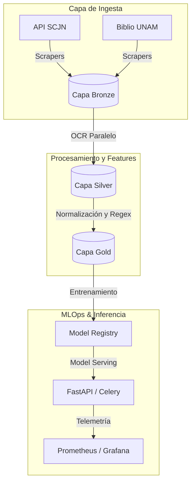

# BETO Legal México

## ⚖️ Resumen 
**BETO Legal México** es un ecosistema avanzado de Procesamiento de Lenguaje Natural (NLP) diseñado específicamente para el análisis, clasificación y Reconocimiento de Entidades Nombradas (NER) de documentos legales y resoluciones jurídicas en México. 

El sistema automatiza la ingesta masiva de corpus desde fuentes clave como la **Suprema Corte de Justicia de la Nación (SCJN)** y la **Biblioteca Jurídica de la UNAM**, procesando la información a través de una arquitectura Lakehouse estructurada en capas (Bronze, Silver, Gold) y gestionando el ciclo de vida completo de los modelos mediante un sólido stack de **MLOps**.

---

## 🚀 Características Principales
* **Ingesta y Extracción Automatizada:** Scrapers modulares para la API de Engroses de la SCJN y tomos de diccionarios jurídicos de la UNAM.
* **Procesamiento OCR Paralelo:** Pipeline de extracción de texto asíncrono optimizado para PDFs escaneados utilizando Tesseract OCR con soporte lingüístico adaptado al español jurídico.
* **Arquitectura de Datos Medallion:** Flujo de datos robusto con trazabilidad completa:
    * **Bronze:** Datos tabulares estructurados (JSON/Excel) y binarios crudos.
    * **Silver:** Texto extraído mediante OCR, limpieza de ruido sintáctico y unificación.
    * **Gold:** Tokens normalizados, remoción selectiva de stopwords y esquemas listos para entrenamiento de embeddings.
* **Stack Inferencia & MLOps Completo:** Orquestación con Airflow, despliegue asíncrono con FastAPI y Celery, infraestructura administrada con Terraform/Kubernetes y telemetría avanzada mediante Prometheus y Grafana.

---

## 📁 Estructura del Repositorio
<!-- readme-tree start -->
<!-- readme-tree end -->

---
# **Aviso Importante**
### Documentación en Hugo 

Para revisar la documentación de arquitectura con hugo consulta la siguiente página:
https://brams153.github.io/BETO_Legal_Mexico/
---

## 🛠️ Requisitos del Sistema e Instalación
### 1. Dependencias de Linux
El pipeline de OCR requiere herramientas nativas del sistema para la rasterización de PDFs y el análisis óptico de caracteres en español. Desde tu terminal (ej. Alacritty en Lubuntu), ejecuta:
```bash
sudo apt update
sudo apt install -y tesseract-ocr tesseract-ocr-spa poppler-utils python3.10-venv

```
### 2. Configuración del Entorno Virtual
Puedes preparar el entorno utilizando el gestor tradicional pip o mediante uv para una resolución determinista ultrarrápida:
**Opción A: Uso eficiente con uv (Recomendado)**
```bash
uv sync

```
**Opción B: Uso tradicional con pip**
```bash
python3 -m venv .venv
source .venv/bin/activate
pip install -e .

```
### 3. Estructura de Almacenamiento Local
Crea los directorios del Lakehouse local antes de iniciar las ejecuciones:
```bash
mkdir -p data/{bronze,silver,gold}

```
## 💻 Guía Práctica de Ejecución
### 1. Ingesta desde el Repositorio de la SCJN
Para descargar y estructurar los metadatos de los engroses de la Suprema Corte de Justicia:
```bash
python src/Beto/pipeline/01_ingestion/scrapers/repositorio_scjn/scrapper_scjn.py

```
*Esto generará un archivo mapeado en data/bronze/scjn/datos_limpios.json y una réplica de validación analítica en scjn_api.xlsx.*
### 2. Ejecución del Pipeline OCR (Bronze -> Silver)
Una vez almacenados los archivos PDF en data/bronze/diccionarios/, procesa la extracción paralela hacia texto plano ejecutable:
```bash
python src/Beto/pipeline/pipelines/ocr_extraction.py

```
*El script consolida el contenido ordenado alfabéticamente dentro de data/silver/diccionarios/diccionario_completo.txt de manera automatizada.*
## 📊 Arquitectura General del Sistema
El flujo de información se rige por un esquema modular interconectado:

## 📝 Licencia y Autores
Desarrollado como un ecosistema avanzado de procesamiento de datos públicos y adaptaciones analíticas.
 * **Autor:** Mireles Alcántara Abraham Apolinar
 * **Institución Referencial:** FCPyS - UNAM
```

